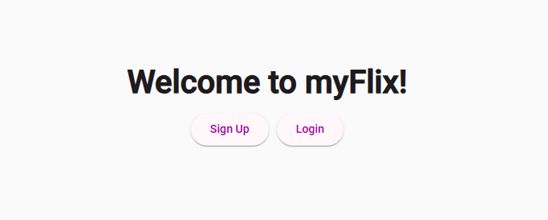

# 🚀 myFlix-Angular-client

<div align="center">

 <!-- TODO: Add project logo -->

[](https://github.com/humblehustler94/myFlix-Angular-client/stargazers)
[](https://github.com/humblehustler94/myFlix-Angular-client/network)
[](https://github.com/humblehustler94/myFlix-Angular-client/issues)
[](LICENSE) <!-- TODO: Add LICENSE file if applicable -->

**A rich, responsive Angular client for the myFlix movie application, enabling users to explore movies, manage profiles, and curate favorites.**

[Live Demo](https://humblehustler94.github.io/myFlix-Angular-client/) <!-- TODO: Add live demo link --> |
[Documentation](https://humblehustler94.github.io/myFlix-Angular-client/docs/) <!-- Link to generated Typedoc documentation -->

</div>

## 📖 Overview

This repository hosts the client-side application for myFlix, a comprehensive movie platform. Built with Angular, this single-page application (SPA) provides a rich, interactive user experience for browsing a vast collection of movies, viewing detailed information about them, managing personal profiles, and curating a list of favorite films. It seamlessly interacts with a RESTful API (myFlix-API) to fetch data and perform user-related operations.

## ✨ Features

-   🎯 **User Authentication**: Secure user registration and login functionality.
-   🎬 **Movie Catalog**: Display a comprehensive list of all available movies.
-   🔍 **Detailed Movie Views**: Access in-depth information for each movie, including genre, director details, and description.
-   ❤️ **Favorite Movies**: Add and remove movies from a personalized list of favorites.
-   👤 **User Profile Management**: View and update personal user information.
-   🗑️ **Account Deletion**: Option for users to delete their account.
-   📱 **Responsive Design**: Optimized for various screen sizes, from desktop to mobile, using Angular Material.
-   🔄 **API Integration**: Robust communication with the myFlix backend API.

## 🖥️ Screenshots

 <!-- TODO: Add actual screenshots of the application -->
 <!-- TODO: Add mobile screenshots -->


## 🛠️ Tech Stack

**Frontend:**
[](https://angular.io/)
[](https://www.typescriptlang.org/)
[](https://material.angular.io/)
[](https://rxjs.dev/)
[](https://developer.mozilla.org/en-US/docs/Web/HTML)
[](https://developer.mozilla.org/en-US/docs/Web/CSS)

**Backend:**
This project is a frontend client application and interacts with a separate **myFlix RESTful API**.
(e.g., [myFlix-API Repository](https://github.com/humblehustler94/myFlix-API)) <!-- TODO: Link to the backend API repository -->

**DevOps & Tools:**
[](https://www.npmjs.com/)
[](https://angular.io/cli)
[](https://typedoc.org/)
[](https://karma-runner.github.io/latest/index.html)
[](https://jasmine.github.io/)

## 🚀 Quick Start

### Prerequisites
Before you begin, ensure you have the following installed:
-   [Node.js](https://nodejs.org/) (LTS version recommended, e.g., 18.x or 20.x)
-   [npm](https://www.npmjs.com/) (comes with Node.js)
-   [Angular CLI](https://angular.io/cli) (globally installed)
    ```bash
    npm install -g @angular/cli
    ```

### Installation

1.  **Clone the repository**
    ```bash
    git clone https://github.com/humblehustler94/myFlix-Angular-client.git
    cd myFlix-Angular-client
    ```

2.  **Install dependencies**
    ```bash
    npm install
    ```

3.  **Environment setup**
    This application uses `src/environments/environment.ts` and `src/environments/environment.prod.ts` for environment-specific configurations, including the API base URL.

    -   Ensure `src/environments/environment.ts` contains the correct API endpoint for your development server:
        ```typescript
        export const environment = {
          production: false,
          apiUrl: 'YOUR_MYFLIX_API_URL_HERE' // e.g., 'http://localhost:8080' or 'https://your-backend.heroku-app.com'
        };
        ```
    -   Similarly, configure `src/environments/environment.prod.ts` for production deployments.

4.  **Start development server**
    ```bash
    npm start
    ```

5.  **Open your browser**
    Visit `http://localhost:4200` to see the application running.

## 📁 Project Structure

```
myFlix-Angular-client/
├── src/
│   ├── app/                      # Main application components, modules, and services
│   │   ├── components/           # UI components (e.g., movie-card, user-profile)
│   │   ├── modules/              # Feature modules
│   │   ├── services/             # Application-wide services (e.g., fetch-api-data, user-service)
│   │   ├── environments/         # Environment configurations (dev, prod API URLs)
│   │   ├── app-routing.module.ts # Root routing module
│   │   └── app.module.ts         # Root application module
│   ├── assets/                   # Static assets (images, icons)
│   ├── styles.scss               # Global styles
│   └── main.ts                   # Application entry point
├── public/                       # Static files that are copied as-is (often empty in Angular)
├── docs/                         # Generated API documentation (Typedoc output)
├── .vscode/                      # VS Code specific settings
├── angular.json                  # Angular CLI configuration
├── package.json                  # Project dependencies and scripts
├── tsconfig.*.json               # TypeScript configurations
└── typedoc.json                  # TypeDoc documentation generator configuration
```

## ⚙️ Configuration

### Environment Variables
Angular applications typically manage environment-specific variables within the `src/environments/` directory.

| File                      | Description                                 | Purpose                                   |
|---------------------------|---------------------------------------------|-------------------------------------------|
| `src/environments/environment.ts` | Development environment configuration | Used for local development (e.g., `npm start`) |
| `src/environments/environment.prod.ts` | Production environment configuration | Used for production builds (`npm run build -- --configuration=production`) |

**Key Variable:**
-   `apiUrl`: The base URL of the myFlix RESTful API backend that this client will connect to.

### Configuration Files
-   `angular.json`: Configures the Angular workspace, including build options, assets, styles, testing, and more.
-   `tsconfig.json`: Base TypeScript configuration for the project.
-   `tsconfig.app.json`: Extends `tsconfig.json` for application-specific TypeScript settings.
-   `typedoc.json`: Configures Typedoc for generating API documentation from TypeScript source files.

## 🔧 Development

### Available Scripts
The `package.json` file includes several convenient scripts for development:

| Command           | Description                                       |
|-------------------|---------------------------------------------------|
| `npm start`       | Runs the application in development mode with live-reloading. |
| `npm run build`   | Builds the project for production, optimizing for deployment. |
| `npm test`        | Executes the unit tests via Karma.                 |
| `npm run lint`    | Lints the project's TypeScript code to ensure consistent style and catch errors. |
| `npm run e2e`     | Executes the end-to-end tests via a browser (typically Protractor). |
| `npm run build:doc` | Generates API documentation using Typedoc.         |

### Development Workflow
1.  Ensure prerequisites are met and dependencies are installed.
2.  Configure the `apiUrl` in `src/environments/environment.ts` to point to your running myFlix backend API.
3.  Run `npm start` to launch the development server.
4.  Make changes to the source code; the app will automatically reload in your browser.

## 🧪 Testing

This project uses Karma for unit testing and Jasmine as the testing framework.

```bash
# Run unit tests
npm test

# Run unit tests with coverage report
# Check angular.json for coverage configuration, typically available with 'ng test --watch=false --code-coverage'
# or configure a specific script if not present
```

## 🚀 Deployment

### Production Build
To create a production-ready build of the application:
```bash
npm run build -- --configuration=production
```
This command compiles the application into static files (HTML, CSS, JavaScript) that can be served by any static file host. The output will be in the `dist/myFlix-Angular-client/` directory.

### Deployment Options
The compiled output is a set of static files, making it deployable to various hosting services:
-   **Static Hosting Platforms**: Deploy `dist/myFlix-Angular-client/` to services like Netlify, Vercel, GitHub Pages, or Firebase Hosting.
-   **Web Servers**: Serve the `dist/myFlix-Angular-client/` directory from a traditional web server (e.g., Nginx, Apache).

## 📚 API Reference

This frontend client consumes an external RESTful API. For detailed information on the available API endpoints, request/response formats, and authentication mechanisms, please refer to the documentation of the myFlix backend API.

The client typically interacts with endpoints such as:
-   `/users`: For user registration, login, profile management.
-   `/movies`: To fetch all movies, specific movie details.
-   `/users/:username/favorites/:movieId`: To manage user's favorite movies.

## 🤝 Contributing

We welcome contributions to the myFlix-Angular-client! If you're looking to contribute, please consider the following:

### Development Setup for Contributors
Follow the [Quick Start](#🚀-quick-start) guide to set up your development environment. Ensure your `apiUrl` points to a local or remote instance of the myFlix backend API for full functionality testing.

### Submitting Changes
1.  Fork the repository.
2.  Create a new branch for your feature or bug fix: `git checkout -b feature/your-feature-name`.
3.  Make your changes, ensuring code style consistency (`npm run lint`).
4.  Write or update unit tests for your changes (`npm test`).
5.  Commit your changes: `git commit -m "feat: Add new feature"`.
6.  Push to your fork: `git push origin feature/your-feature-name`.
7.  Open a Pull Request to the `main` branch of this repository, providing a clear description of your changes.

<!--
## 📄 License

This project is licensed under the [LICENSE_NAME](LICENSE) - see the LICENSE file for details. <!-- TODO: Specify actual license name and add LICENSE file -->

## 🙏 Acknowledgments

-   Built with [Angular](https://angular.io/) for a robust frontend experience.
-   Utilizes [Angular Material](https://material.angular.io/) for a consistent and responsive UI.
-   Special thanks to the open-source community for the invaluable tools and libraries.

## 📞 Support & Contact

-  🐛 Issues: [GitHub Issues](https://github.com/humblehustler94/myFlix-client/issues)
-  👤 Author: [humblehustler94](https://github.com/humblehustler94)
-  📧 Email: [flores.itzel94@gmail.com]

---

<div align="center">

**⭐ Star this repo if you find it helpful!**

Made with ❤️ by humblehustler94

</div>
